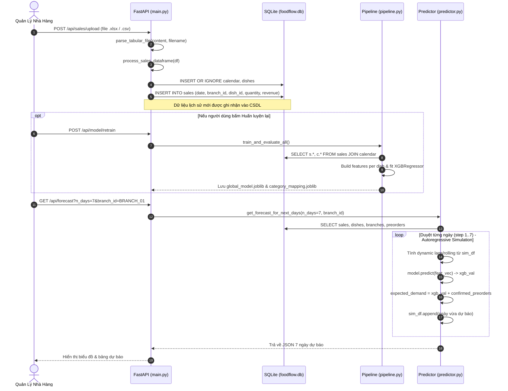

# BÁO CÁO KỸ THUẬT CHUYÊN SÂU: KIẾN TRÚC & MÃ NGUỒN FOODFLOW AI

> **Dự án:** FoodFlow AI — Nền tảng AI dự báo nhu cầu & tối ưu chuỗi cung ứng F&B  
> **Kiến trúc:** 2 tầng — Off-chain (FastAPI + XGBoost + SQLite) & On-chain (Solana Devnet, Anchor/Rust)  
> **Phạm vi phân tích:** Mã nguồn chi tiết tại `backend/app/forecasting/`, `backend/app/services/`, và `programs/foodflow-audit/`

---

## 1. FORECASTING PIPELINE (Mô Hình & Kỹ Thuật Dự Báo)

### 1.1. Feature Engineering thực sự tính toán thế nào?

Toàn bộ logic tạo đặc trưng nằm tại [`features.py`](backend/app/forecasting/features.py) và [`vn_calendar.py`](backend/app/forecasting/vn_calendar.py).

#### A. Lags & Rolling Statistics:
> **Lưu ý quan trọng từ mã nguồn thực tế:** Mã nguồn sử dụng các độ trễ **`[1, 7, 14, 28]` ngày**, hoàn toàn **KHÔNG có `lag_3`**. Lý do thiết kế: Chu kỳ tiêu thụ ngành F&B mang tính tuần hoàn 7 ngày (tuần trước, 2 tuần trước, 4 tuần trước).

Trong hàm `build_features_for_dish` ([`backend/app/forecasting/features.py: L32-L48`](backend/app/forecasting/features.py)):
```python
# 2. Lag Features
for lag in [1, 7, 14, 28]:
    df[f"lag_{lag}"] = df["quantity"].shift(lag)

# 3. Rolling Statistics Features (dùng shift 1 để không rò rỉ dữ liệu target của ngày hiện tại)
df["rolling_mean_7"] = df["quantity"].shift(1).rolling(window=7, min_periods=1).mean()
df["rolling_mean_14"] = df["quantity"].shift(1).rolling(window=14, min_periods=1).mean()
df["rolling_mean_28"] = df["quantity"].shift(1).rolling(window=28, min_periods=1).mean()
df["rolling_std_7"] = df["quantity"].shift(1).rolling(window=7, min_periods=1).std().fillna(0)

# 4. Tết features (6 cột)
df = add_tet_features(df)

# 5. Fill NA cho những ngày đầu tiên (khi lag chưa đủ)
df = df.bfill().ffill()
```

- **Chống Data Leakage (Rò rỉ dữ liệu):** Khi tính `rolling_mean` và `rolling_std`, code bắt buộc gọi `.shift(1)` trước `.rolling(...)` nhằm đảm bảo số lượng bán của ngày $T$ không bị tính vào trung bình trượt dùng để dự báo chính ngày $T$.
- **Xử lý giá trị thiếu (NaN):** Với 28 ngày đầu tiên khi chuỗi chưa đủ độ trễ, hệ thống dùng `bfill().ffill()` để lấp đầy dữ liệu.

#### B. Lịch & Ngày Lễ (`is_holiday` & Lịch Tết):
Trong [`features.py`](backend/app/forecasting/features.py) và [`vn_calendar.py`](backend/app/forecasting/vn_calendar.py):
- `day_of_week` ($0 \rightarrow 6$), `day_of_month`, `month`, `is_weekend` ($1$ nếu thứ 7 hoặc Chủ Nhật, ngược lại $0$).
- `is_holiday`: Được nạp từ bảng `calendar` trong cơ sở dữ liệu SQLite, đối chiếu danh sách ngày dương lịch cố định: 01-01 (Tết Tây), 02-14 (Valentine), 03-08 (8/3), 04-30 (30/4), 05-01 (1/5), 09-02 (2/9), 10-20 (20/10), 11-20 (20/11), 12-24 (Noel Eve), 12-25 (Noel).
- **6 Đặc trưng Tết Nguyên Đán** (tính khoảng cách ngày âm lịch qua hàm `add_tet_features` tại [`vn_calendar.py: L94-L132`](backend/app/forecasting/vn_calendar.py)):
```python
df["days_to_tet"] = df["date"].apply(_get_nearest_tet_delta)
df["days_to_tet_abs"] = df["days_to_tet"].abs()
df["is_pre_tet"] = ((df["days_to_tet"] >= -30) & (df["days_to_tet"] <= -1)).astype(int)
df["is_tat_nien_period"] = ((df["days_to_tet"] >= -21) & (df["days_to_tet"] <= -1)).astype(int)
df["is_tet"] = ((df["days_to_tet"] >= 0) & (df["days_to_tet"] <= 2)).astype(int)
df["is_post_tet"] = ((df["days_to_tet"] >= 3) & (df["days_to_tet"] <= 7)).astype(int)
```

---

### 1.2. Huấn luyện XGBoost: Per (dish, branch) hay Model chung? Hyperparameters?

Trong [`pipeline.py: L154-L165`](backend/app/forecasting/pipeline.py):
Hệ thống sử dụng **1 GLOBAL MODEL DUY NHẤT (Global Model v2)** cho toàn bộ mạng lưới (3 chi nhánh $\times$ 22 món ăn = 66 chuỗi thời gian) thay vì huấn luyện từng mô hình nhỏ lẻ.

```python
model = xgb.XGBRegressor(
    n_estimators=100,
    max_depth=4,
    learning_rate=0.07,
    subsample=0.85,
    colsample_bytree=0.85,
    enable_categorical=True,
    tree_method="hist",
    random_state=42,
)
```

#### Cơ chế học khác biệt giữa các chi nhánh & món ăn:
Thay vì dùng One-Hot Encoding làm bùng nổ số chiều ma trận, pipeline áp dụng tính năng Categorical nguyên bản của XGBoost:
```python
def prepare_categorical_dtypes(df: pd.DataFrame) -> pd.DataFrame:
    df["branch_id"] = df["branch_id"].astype("category")
    df["dish_id"] = df["dish_id"].astype("category")
    df["event_flag"] = df["event_flag"].fillna("none").astype("category")
    return df
```
File `category_mapping.joblib` được lưu song song cùng `global_model.joblib` để đảm bảo khi inference ở [`predictor.py`](backend/app/forecasting/predictor.py), thứ tự các category index khớp 100% với tập huấn luyện.

---

### 1.3. Điều kiện Trigger Fallback về Baseline (Số ngày data)?

Cơ chế fallback được định nghĩa trực tiếp trong vòng lặp dự báo tại [`predictor.py: L127-L184`](backend/app/forecasting/predictor.py):

```python
if len(sim_df) >= 7:
    # 1. Tính các đặc trưng lag_1, lag_7, lag_14, lag_28, rolling_7...
    ...
    # 2. Baseline: Trung bình cùng thứ trong 4 tuần gần nhất
    same_dow = sim_df[pd.to_datetime(sim_df["date"]).dt.dayofweek == dow]["quantity"].tail(4)
    base_val = int(round(same_dow.mean() if len(same_dow) > 0 else rolling_7))

    # 3. XGBoost Global Model prediction
    if model is not None:
        pred_val = model.predict(feat_vec)[0]
        xgb_val = int(round(max(pred_val, 0)))
    else:
        xgb_val = base_val
else:
    # Fallback khi KHÔNG ĐỦ DỮ LIỆU (< 7 ngày lịch sử)
    base_val = 30
    xgb_val = 30
```

Hai tầng fallback cụ thể:
1. **Điều kiện dữ liệu tối thiểu:** Nếu chuỗi lịch sử của món tại chi nhánh có **`< 7 ngày data`**: Cả Baseline và XGBoost đều fallback về giá trị mặc định tĩnh: **`30 đơn vị`**.
2. **Điều kiện thiếu Model (`model is None`):** Nếu `>= 7 ngày` nhưng file model `.joblib` bị lỗi hoặc chưa huấn luyện, `xgb_val` sẽ fallback lấy trực tiếp giá trị của `base_val` (Moving Average cùng thứ 4 tuần trước).

---

## 2. LUỒNG DỮ LIỆU END-TO-END (Upload $\rightarrow$ Forecast $\rightarrow$ Mua Hàng)

### 2.1. Từ khi upload sales `.xlsx` đến khi ra forecast



#### Chi tiết các hàm thực thi:
1. `parse_tabular_file(file_content, filename)` ([`backend/app/main.py: L570-L582`](backend/app/main.py)): Tự động nhận diện đuôi `.xlsx`/`.xls` dùng `pd.read_excel(io.BytesIO(...))` hoặc thử qua các encoding `['utf-8-sig', 'utf-8', 'cp1252', 'latin1']` với `pd.read_csv`.
2. `process_sales_dataframe(df)` ([`backend/app/main.py: L649-L714`](backend/app/main.py)): Chuẩn hóa tên cột tiếng Việt (`ngay`, `so_luong`, `ma_mon`...), tạo tự động bản ghi thiếu trong `calendar` và `dishes`, sau đó chèn vào bảng `sales`.
3. `get_forecast_for_next_days(...)` ([`backend/app/forecasting/predictor.py: L31-L238`](backend/app/forecasting/predictor.py)): Đọc dữ liệu lịch sử đến ngày mới nhất `last_date = df_sales["date"].max()`. Dự báo đệ quy (*autoregressive*): ngày $T+1$ được dự báo xong sẽ đưa ngược vào `sim_df` làm lag feature cho ngày $T+2$.

---

### 2.2. Công thức tính "Danh Sách Mua Hàng" trong `recommendation_service.py`

Hàm `get_purchase_recommendations` ([`backend/app/services/recommendation_service.py: L21-L211`](backend/app/services/recommendation_service.py)) thực hiện quy đổi qua 4 bước:

#### Bước 1: Quy đổi nhu cầu món sang nguyên liệu (Bill of Materials - BOM):
$$\text{RequiredQty}(ing) = \sum_{dish \in Recipes} \Big(\text{ExpectedDemand}(dish) \times \text{BOM\_Quantity}(dish, ing)\Big)$$
*Code [`recommendation_service.py: L106-L115`](backend/app/services/recommendation_service.py):*
```python
ingredient_requirements = {}
for _, recipe in df_recipes.iterrows():
    d_id = recipe["dish_id"]
    ing_id = recipe["ingredient_id"]
    qty_per_portion = recipe["quantity"]

    dish_demand = dish_demands.get(d_id, 0)
    needed = dish_demand * qty_per_portion
    ingredient_requirements[ing_id] = ingredient_requirements.get(ing_id, 0.0) + needed
```

#### Bước 2: Đối chiếu tồn kho và tính lượng mua (Safety Stock Formula):
*Code [`recommendation_service.py: L140-L148`](backend/app/services/recommendation_service.py):*
```python
shortage = max(round(required_qty - current_stock, 2), 0.0)

# Công thức đề xuất mua:
if required_qty > current_stock:
    # Khi thiếu: Mua phần thiếu hụt + đệm an toàn 20% min_stock
    recommended_purchase = round(required_qty - current_stock + (min_stk * 0.2), 1)
elif (current_stock - required_qty) < min_stk:
    # Khi đủ dùng ngày mai nhưng số dư sau dùng tụt dưới min_stock: Mua bù lên mức min_stock
    recommended_purchase = round(min_stk - (current_stock - required_qty), 1)
else:
    recommended_purchase = 0.0
```

#### Bước 3: Phân loại trạng thái nguyên liệu:
*Code [`recommendation_service.py: L151-L170`](backend/app/services/recommendation_service.py):*
- **`CRITICAL` (Thiếu khẩn cấp):** `required_qty > 0` và `current_stock < (required_qty * 0.35)` (tồn kho hiện tại đáp ứng dưới 35% nhu cầu).
- **`WARNING` (Cần mua bổ sung):** `shortage > 0` hoặc `recommended_purchase > 0`.
- **`EXCESS` (Tồn dư nhiều):** `current_stock > (required_qty * 3.5)` và `required_qty > 0`.
- **`SUFFICIENT` (Đủ nguyên liệu):** Các trường hợp còn lại.

> **Hiện trạng thực tế của FEFO trong `recommendation_service.py`:**  
> Hiện tại dòng 40-44 chỉ truy vấn số dư gộp:  
> `SELECT ingredient_id, quantity as current_stock FROM inventory WHERE branch_id = ?`  
> Dịch vụ **chưa tự động trừ** các lô hàng trong `inventory_batches` có ngày hết hạn trước ngày mục tiêu (`expiry_date < target_date`). Đây là một điểm cần hoàn thiện khi chuyển lên production.

---

## 3. TẦNG BLOCKCHAIN (Solana Devnet, Anchor/Rust & Dual-Commitment)

### 3.1. `solana_service.py` vs Instruction trong `lib.rs`

#### A. Phân tích thực trạng trong `solana_service.py`:
Trong [`solana_service.py: L144-L147`](backend/app/services/solana_service.py):
```python
# Ký payload bằng Server Keypair
sig_raw = SERVER_KEYPAIR.sign_message(record_hash.encode('utf-8'))
tx_signature = str(sig_raw)
explorer_url = f"{SOLANA_EXPLORER_BASE}/{tx_signature}?cluster=devnet"
```
Mã nguồn backend đang sử dụng chữ ký mật mã Ed25519 cục bộ (`SERVER_KEYPAIR.sign_message`) để tạo ra chuỗi signature chứng minh tính xác thực từ server authority (chế độ mô phỏng phục vụ demo mượt mà, không phụ thuộc vào độ trễ mạng Devnet).

#### B. Thiết kế Smart Contract trong `lib.rs`:
Hợp đồng Anchor tại [`programs/foodflow-audit/src/lib.rs`](programs/foodflow-audit/src/lib.rs) đã định nghĩa đầy đủ 3 instruction cốt lõi:

| Instruction | Accounts yêu cầu | Input Arguments | Thao tác thực hiện |
| :--- | :--- | :--- | :--- |
| **`initialize_restaurant_registry`** | `registry` (PDA), `authority` (Signer), `system_program` | `restaurant_name: String`, `branch_id: String` | Khởi tạo tài khoản gốc quản lý chi nhánh, đếm tổng batch & PO. |
| **`record_ingredient_batch`** | `registry` (PDA mut), `batch_record` (PDA init), `authority`, `system_program` | `batch_code: String`, `ingredient_id: String`, `ingredient_name: String`, `record_hash: [u8; 32]`, `quantity: f64`, `expiry_timestamp: i64` | Lưu hash SHA-256 của lô nguyên liệu FEFO, tăng biến đếm `total_batches_notarized`, bắn event `BatchNotarizedEvent`. |
| **`record_ai_purchase_order`** | `registry` (PDA mut), `po_record` (PDA init), `authority`, `system_program` | `po_id: String`, `target_date: String`, `record_hash: [u8; 32]`, `total_estimated_cost: u64`, `ai_model_version: String` | Lưu hash bằng chứng kép của đơn mua hàng, tăng `total_po_notarized`, bắn event `PurchaseOrderNotarizedEvent`. |
| **`verify_record_hash`** | `batch_record` (Account) | `expected_hash: [u8; 32]` | Đối chiếu hash truyền vào với hash trên PDA; revert với lỗi `FoodFlowError::HashMismatch` nếu phát hiện dữ liệu bị can thiệp. |

---

### 3.2. Cấu Trúc Băm & Ghi On-Chain của "Dual-Commitment Proof"

"Dual-Commitment Proof" (Bằng chứng cam kết kép) đảm bảo rằng sau khi AI đưa ra gợi ý và nhân viên đi chợ xong, **cả kế hoạch đề xuất, số liệu mua thực tế, lý do giải trình và phán quyết của AI đều bị khóa cứng không thể sửa đổi**.

#### A. Chuỗi chuẩn hóa (Canonical String) & Thuật toán băm:
Trong [`solana_service.py: L62-L78`](backend/app/services/solana_service.py):
```python
def compute_po_hash(po: Dict[str, Any]) -> str:
    items = po.get('items', [])
    # Sắp xếp item theo ingredient_id để bảo đảm tính tất định (Deterministic)
    items_sorted = sorted(items, key=lambda x: str(x.get('ingredient_id', '')))
    items_str = ";".join([
        f"{it.get('ingredient_id')}:{float(it.get('quantity') or 0):.2f}@{float(it.get('cost_per_unit') or 0):.0f}"
        for it in items_sorted
    ])
    reason_clean = (po.get('variance_reason') or '').strip().lower()
    ai_verdict = po.get('ai_verdict') or 'COMPLIANT'
    variance_pct = float(po.get('variance_pct') or 0.0)
    
    canonical_str = f"PURCHASE_ORDER|{po.get('date','')}|{po.get('branch_id','')}|{float(po.get('total_spent') or 0):.0f}|{variance_pct:.1f}%|{reason_clean}|{ai_verdict}|{items_str}"
    return hashlib.sha256(canonical_str.encode('utf-8')).hexdigest()
```

#### B. Cấu trúc dữ liệu ghi on-chain (Rust Struct):
Khi gọi instruction `record_ai_purchase_order`, hash 32 bytes này được lưu vào Struct [`programs/foodflow-audit/src/lib.rs: L214-L224`](programs/foodflow-audit/src/lib.rs):
```rust
#[account]
pub struct PurchaseOrderAuditEntry {
    pub authority: Pubkey,            // 32 bytes: Địa chỉ ví quản trị ký duyệt
    pub branch_id: String,            // Chi nhánh áp dụng
    pub po_id: String,                // Mã định danh đơn mua hàng
    pub target_date: String,          // Ngày áp dụng đơn mua
    pub record_hash: [u8; 32],        // 32 bytes: SHA-256 hash của Canonical String
    pub total_estimated_cost: u64,    // Tổng tiền thanh toán (VNĐ)
    pub ai_model_version: String,     // Phiên bản mô hình (vd: "XGBoost-DemandForecaster-v2.1")
    pub notarized_at: i64,            // Unix timestamp khi đóng block
}
```

---

### 3.3. Cơ chế PDA (Program Derived Address) & Lý do chọn Seeds

Hợp đồng định nghĩa 3 loại PDA với cấu trúc phân cấp:

```
[Authority Keypair] 
       │ (Ký giao dịch khởi tạo)
       ▼
[RestaurantRegistry PDA]  ─── seeds = [b"restaurant_registry", branch_id.as_bytes()]
       │
       ├─── [BatchAuditEntry PDA]         ─── seeds = [b"batch_audit", branch_id, batch_code]
       └─── [PurchaseOrderAuditEntry PDA] ─── seeds = [b"po_audit", branch_id, po_id]
```

#### Tại sao lại thiết kế Seeds như vậy?
1. **Phân vùng dữ liệu (Multi-tenant Partitioning):** Đưa `branch_id` vào mọi seed giúp cô lập hoàn toàn sổ cái giữa các chi nhánh nhà hàng. Chi nhánh này không thể can thiệp hay đọc sai tài khoản của chi nhánh khác.
2. **Tính duy nhất & Chống gian lận (Deterministic Uniqueness):**
   - Một lô hàng (`batch_code`) tại 1 chi nhánh chỉ có thể sinh ra đúng 1 địa chỉ PDA duy nhất.
   - Do Anchor dùng macro `init` (`init, payer = authority`), nếu một nhân viên cố tình gọi lại hàm để sửa lùi ngày hết hạn của cùng một `batch_code`, transaction sẽ lập tức bị runtime từ chối vì tài khoản PDA đó đã tồn tại.
3. **Truy vấn $O(1)$ không cần cơ sở dữ liệu phụ trợ:** Bất kỳ kiểm toán viên nào chỉ cần biết `branch_id` và `batch_code` là có thể tự tính ra ngay địa chỉ PDA on-chain qua hàm `Pubkey::find_program_address` mà không cần phụ thuộc vào API server hay database off-chain.

---

## 4. ĐIỂM CẦN LÀM RÕ & RỦI RO KỸ THUẬT

### 4.1. Chỗ nào trong code là "Giả lập/Demo" vs "Production-ready"?

| Thành phần | Trạng thái | Chi tiết mã nguồn |
| :--- | :---: | :--- |
| **Pipeline Feature Engineering** | **Production-ready** | Tính lag 1/7/14/28, rolling stats có `.shift(1)`, xử lý lịch Tết âm lịch và ngày lễ hoàn chỉnh, không rò rỉ dữ liệu. |
| **Mô hình XGBoost Global** | **Production-ready** | Huấn luyện chung toàn chuỗi qua `enable_categorical=True`, tối ưu tốc độ bằng `tree_method="hist"`, đánh giá WAPE/MAE tách bạch. |
| **Quy đổi BOM & Safety Stock** | **Production-ready** | Tự động bóc tách định lượng món ra nguyên liệu, áp dụng đệm tồn kho an toàn và phân loại trạng thái thiếu hụt. |
| **AI Variance Evaluator** | **Production-ready (Rule-based)** | Phát hiện biến động giá/khối lượng, phân tích ngữ nghĩa bộ từ khóa tiếng Việt (thiên tai, lễ hội, hư hỏng, giá sỉ) chuẩn xác. |
| **Ký Giao Dịch Solana** | **Giả lập / Demo** | `solana_service.py` ký Ed25519 off-chain bằng `SERVER_KEYPAIR.sign_message` thay vì phát transaction thực sự qua RPC Devnet. |
| **Program ID trên Anchor** | **Giả lập / Demo** | ID `FoodF1owAudit1111111111111111111111111111111` trong [`programs/foodflow-audit/src/lib.rs: L3`](programs/foodflow-audit/src/lib.rs) là địa chỉ giả lập mẫu (placeholder), chưa deploy keypair thực tế lên mạng. |
| **FEFO Deductive Engine** | **Bán hoàn thiện** | Đã băm lưu lô hàng hạn dùng vào `inventory_batches`, nhưng công thức mua hàng ở `recommendation_service.py` vẫn đang cộng gộp bảng `inventory` chung chứ chưa tự trừ lô hết hạn. |
| **Số dư ví trên Dashboard** | **Demo Hardcode** | `devnet_balance_sol: 2.5` trong hàm `get_solana_network_status` ([`backend/app/services/solana_service.py: L304`](backend/app/services/solana_service.py)) là số fix cứng. |

---

### 4.2. Nếu Migrate SQLite $\rightarrow$ PostgreSQL: Phần nào cần sửa?

Mã nguồn hiện tại phụ thuộc chặt chẽ vào thư viện chuẩn `sqlite3`. Khi chuyển sang PostgreSQL, cần tái cấu trúc 5 vị trí:

1. **Thay đổi Thư Viện Kết Nối & Connection Pool:**
   - Thay `import sqlite3` bằng `asyncpg` hoặc `SQLAlchemy` / `psycopg3`. SQLite cho phép mở kết nối trực tiếp dạng file, trong khi PostgreSQL bắt buộc phải cấu hình connection pool (như `SQLAlchemy.pool.QueuePool`) để tránh nghẽn I/O khi chịu tải lớn.
2. **Cú Pháp SQL Dialect Khác Biệt:**
   - **Tự tăng khóa chính:** Thay `INTEGER PRIMARY KEY AUTOINCREMENT` thành `BIGSERIAL PRIMARY KEY` hoặc `GENERATED ALWAYS AS IDENTITY`.
   - **Xử lý xung đột (Upsert):**
     - Thay `INSERT OR IGNORE INTO dishes ...` thành `INSERT INTO dishes ... ON CONFLICT (id) DO NOTHING`.
     - Thay `INSERT OR REPLACE INTO dishes ...` thành `INSERT INTO dishes ... ON CONFLICT (id) DO UPDATE SET ...`.
3. **Tham số hóa truy vấn (Parameter Placeholders):**
   - SQLite dùng dấu hỏi chấm `?` (ví dụ `WHERE branch_id = ?`).
   - PostgreSQL dùng `%s` (psycopg) hoặc `$1, $2` (asyncpg). Toàn bộ các câu `cur.execute(query, params)` trong `main.py`, `pipeline.py`, `predictor.py`, `recommendation_service.py` đều phải đổi placeholder.
4. **Kiểu dữ liệu Thời Gian & JSON:**
   - Đổi các cột lưu ngày tháng từ `TEXT` sang kiểu dữ liệu chuẩn `DATE` và `TIMESTAMPTZ`.
   - Đổi cột `preorders.items_json` từ `TEXT` sang `JSONB` của PostgreSQL để có thể query trực tiếp vào từng món trong đơn đặt trước bằng toán tử `->>`.
5. **Công Cụ Quản Lý Migration:**
   - Hiện tại hàm `init_db_schema` ([`backend/app/main.py: L68-L150`](backend/app/main.py)) và `_ensure_solana_schema` ([`backend/app/services/solana_service.py: L250-L279`](backend/app/services/solana_service.py)) đang dùng các lệnh `ALTER TABLE ADD COLUMN` đặt trong khối `try...except` rất thô sơ. Cần chuyển sang sử dụng **Alembic** để quản lý migration chuyên nghiệp.

---

### 4.3. Nếu Devnet $\rightarrow$ Mainnet: lib.rs cần Review lại những gì?

Ngoài việc thay đổi RPC Endpoint sang các nhà cung cấp Node chuyên dụng (như Helius, QuickNode, Triton), tầng Smart Contract trong [`programs/foodflow-audit/src/lib.rs`](programs/foodflow-audit/src/lib.rs) cần tái thiết kế ở 4 khía cạnh:

#### A. Chi phí Rent Exemption (Cực kỳ quan trọng trên Mainnet):
- Trong `lib.rs`, các instruction `RecordBatch` và `RecordPurchaseOrder` sử dụng `init, payer = authority` để tạo mới một tài khoản PDA cho **từng lô hàng** và **từng đơn đi chợ**.
- Trên Solana Mainnet, duy trì miễn phí thuê (Rent-exempt) cho một tài khoản ~200 bytes tốn khoảng `0.0015 - 0.002 SOL`. Với chuỗi nhà hàng phát sinh hàng nghìn lô hàng mỗi tháng, việc tạo PDA liên tục sẽ tiêu tốn lượng SOL đáng kể mà không bao giờ thu hồi lại.
- **Giải pháp tối ưu:** 
  1. Thêm instruction `close` tài khoản khi lô hàng đã dùng hết để hoàn lại Rent cho ví authority.
  2. Hoặc chuyển đổi sang **State Compression (Compressed Account / Bubblegum)**: Băm dữ liệu vào một cây Merkle Tree On-chain, chi phí chứng thực sẽ giảm xuống hàng nghìn lần (chỉ tốn phí giao dịch, không tốn Rent).

#### B. Tính Toán Dung Lượng Cấp Phát (`space` allocation) của String:
- Trong [`lib.rs: L150`](programs/foodflow-audit/src/lib.rs): `space = 8 + 32 + 32 + 64 + 32 + 64 + 32 + 8 + 8 + 8`.
- Trong Anchor, `String` được tuần tự hóa gồm `4 bytes độ dài (prefix)` + `số bytes thực tế của chuỗi UTF-8`.
- Nếu tên nguyên liệu (`ingredient_name`), mã lô (`batch_code`) hoặc phiên bản AI (`ai_model_version`) có độ dài vượt quá số byte dự trù, giao dịch trên Mainnet sẽ lập tức văng lỗi **`AccountDidNotDeserialize`** hoặc lỗi tràn bộ nhớ. Cần định rõ ràng kích thước tối đa cho từng trường hoặc dùng `realloc`.

#### C. Compute Budget & Phí Ưu Tiên (Priority Fees):
- Mainnet thường xuyên gặp tình trạng nghẽn mạng do biến động giao dịch.
- Nếu gửi transaction với cấu hình mặc định (200,000 CU, không có Priority Fee), các giao dịch notarize sẽ bị rớt khỏi mempool của validator.
- Client cần bổ sung 2 chỉ thị vào transaction:
  - `ComputeBudgetInstruction::set_compute_unit_limit(...)`
  - `ComputeBudgetInstruction::set_compute_unit_price(...)` (tính theo micro-lamports trên mỗi CU).

#### D. Bảo Mật Khóa Ký Server (Server Authority Security):
- File [`solana_service.py: L24`](backend/app/services/solana_service.py) đang đọc private key từ file JSON lưu trên đĩa cứng: `solana_authority.json`.
- Khi lên Mainnet, Private Key của Authority không được lưu dưới dạng plain text trên server mà phải được ủy thác qua **AWS KMS**, **HashiCorp Vault**, hoặc dùng kiến trúc **MPC (Multi-Party Computation)** / ví đa chữ ký **Squads Protocol**.
