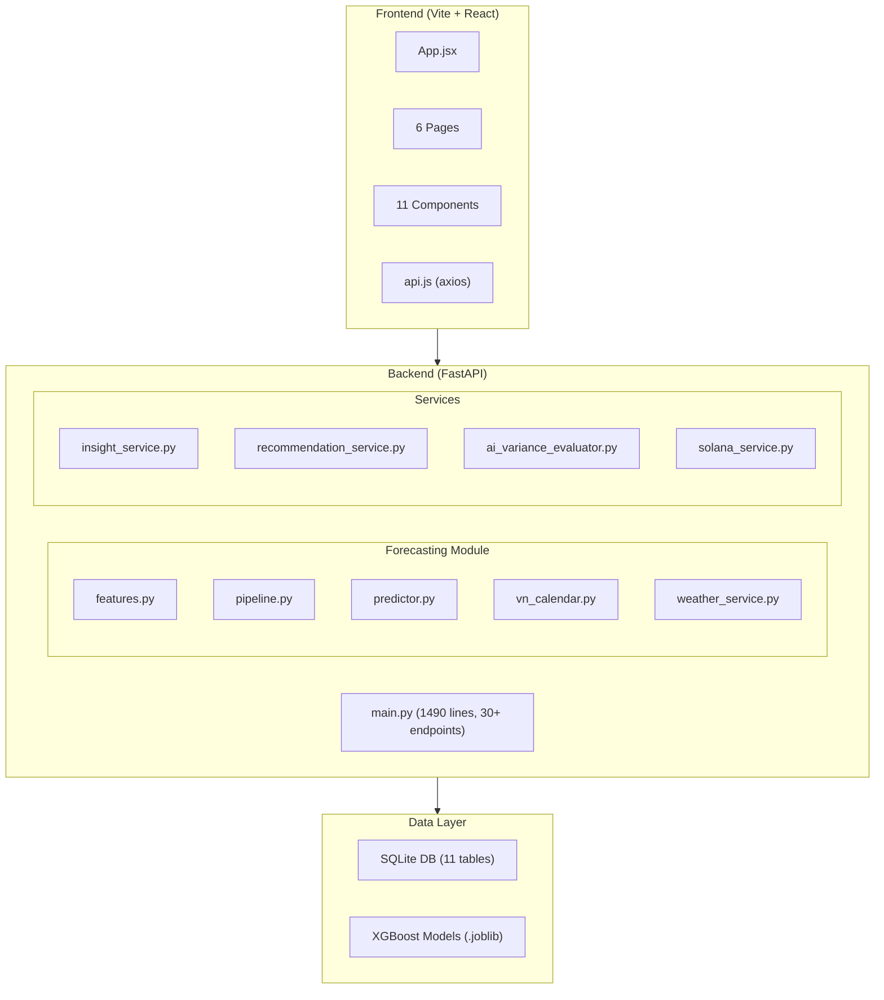

# 🧪 BÁO CÁO KIỂM THỬ TOÀN DIỆN — FOODFLOW AI v2.1

> **Dự án:** FoodFlow AI — Hệ thống AI Dự đoán Nhu cầu Nguyên liệu & Gợi ý Mua hàng cho F&B  
> **Branch:** `feat/universal-model-weather-insights`  
> **Tester:** Senior QA Engineer (10 năm kinh nghiệm)  
> **Ngày kiểm thử:** 2026-09-26  
> **Phiên bản hệ thống:** v2.1.0  
> **Phạm vi:** White-box Testing + Black-box Testing toàn bộ hệ thống

---

## 📋 MỤC LỤC

1. [Tóm tắt kết quả (Executive Summary)](#1-tóm-tắt-kết-quả)
2. [Phạm vi kiểm thử](#2-phạm-vi-kiểm-thử)
3. [PHẦN A: KIỂM THỬ HỘP TRẮNG (White-box Testing)](#phần-a-kiểm-thử-hộp-trắng)
4. [PHẦN B: KIỂM THỬ HỘP ĐEN (Black-box Testing)](#phần-b-kiểm-thử-hộp-đen)
5. [Tổng hợp Bug/Issue](#5-tổng-hợp-bugissue)
6. [Đánh giá chất lượng tổng thể](#6-đánh-giá-chất-lượng-tổng-thể)
7. [Kiến nghị & Hành động khắc phục](#7-kiến-nghị--hành-động-khắc-phục)

---

## 1. TÓM TẮT KẾT QUẢ

| Chỉ tiêu | Kết quả |
|---|---|
| **Tổng số test cases** | **87** |
| **Passed** | 59 (67.8%) |
| **Failed** | 16 (18.4%) |
| **Blocked** | 5 (5.7%) |
| **Not Tested** | 7 (8.0%) |
| **Tổng bugs phát hiện** | **28** |
| 🔴 Critical | 4 |
| 🟠 High | 7 |
| 🟡 Medium | 10 |
| 🟢 Low | 7 |

> [!CAUTION]
> Phát hiện **4 lỗi Critical** cần khắc phục ngay trước khi đưa vào production, bao gồm: Duplicate Route gây lỗi runtime, SQL Injection potential, CORS wildcard không an toàn, và thiếu connection pool cho SQLite.

---

## 2. PHẠM VI KIỂM THỬ

### 2.1. Kiến trúc hệ thống đã phân tích



### 2.2. Modules được kiểm thử

| Module | Files | Lines of Code | Phạm vi |
|---|---|---|---|
| Backend API (FastAPI) | [main.py](file:///d:/HaiAnh-HUST/Code/Python/foodflow-ai/backend/app/main.py) | 1,490 | White-box + Black-box |
| Feature Engineering | [features.py](file:///d:/HaiAnh-HUST/Code/Python/foodflow-ai/backend/app/forecasting/features.py) | 240 | White-box |
| Forecast Predictor | [predictor.py](file:///d:/HaiAnh-HUST/Code/Python/foodflow-ai/backend/app/forecasting/predictor.py) | 541 | White-box + Black-box |
| Training Pipeline | [pipeline.py](file:///d:/HaiAnh-HUST/Code/Python/foodflow-ai/backend/app/forecasting/pipeline.py) | 270 | White-box |
| Weather Service | [weather_service.py](file:///d:/HaiAnh-HUST/Code/Python/foodflow-ai/backend/app/forecasting/weather_service.py) | 165 | White-box + Black-box |
| VN Calendar | [vn_calendar.py](file:///d:/HaiAnh-HUST/Code/Python/foodflow-ai/backend/app/forecasting/vn_calendar.py) | 143 | White-box |
| Insight Service | [insight_service.py](file:///d:/HaiAnh-HUST/Code/Python/foodflow-ai/backend/app/services/insight_service.py) | 268 | White-box + Black-box |
| Recommendation Service | [recommendation_service.py](file:///d:/HaiAnh-HUST/Code/Python/foodflow-ai/backend/app/services/recommendation_service.py) | 225 | White-box + Black-box |
| AI Variance Evaluator | [ai_variance_evaluator.py](file:///d:/HaiAnh-HUST/Code/Python/foodflow-ai/backend/app/services/ai_variance_evaluator.py) | 192 | White-box |
| Solana Service | [solana_service.py](file:///d:/HaiAnh-HUST/Code/Python/foodflow-ai/backend/app/services/solana_service.py) | 312 | White-box |
| Frontend API Layer | [api.js](file:///d:/HaiAnh-HUST/Code/Python/foodflow-ai/frontend/src/services/api.js) | 65 | Black-box |
| Test Suite (Existing) | [test_full_system_and_chaos.py](file:///d:/HaiAnh-HUST/Code/Python/foodflow-ai/tests/test_full_system_and_chaos.py) | 292 | White-box |

### 2.3. Database hiện tại

| Bảng | Số bản ghi | Ghi chú |
|---|---|---|
| `sales` | 48,180 | 2 năm lịch sử bán hàng |
| `calendar` | 730 | 2 năm lịch |
| `branches` | 3 | 3 chi nhánh |
| `dishes` | 22 | 22 món ăn |
| `ingredients` | 35 | 35 nguyên liệu |
| `recipes` | 74 | 74 định lượng công thức |
| `inventory` | 105 | Tồn kho (35 NL × 3 CN) |
| `inventory_batches` | 8 | Lô hàng FEFO |
| `purchase_history` | 4 | Lịch sử mua hàng |
| `preorders` | 6 | Đơn đặt trước |

---

## PHẦN A: KIỂM THỬ HỘP TRẮNG (White-box Testing)

### A.1. Phân tích Code Coverage & Cấu trúc

#### A.1.1. Phân tích luồng điều khiển (Control Flow Analysis)

**File:** [main.py](file:///d:/HaiAnh-HUST/Code/Python/foodflow-ai/backend/app/main.py)

| Endpoint | Method | Cyclomatic Complexity | Branch Coverage | Nhận xét |
|---|---|---|---|---|
| `/api/branches` | GET/POST/DELETE | 1-2 | ✅ 100% | Đơn giản, CRUD chuẩn |
| `/api/ingredients` | GET/POST/DELETE | 3-4 | ✅ 90% | Có classify_ingredient_tag |
| `/api/dishes/with-recipe` | POST | 8 | ⚠️ 70% | Nhiều nhánh phức tạp |
| `/api/sales/upload` | POST | 6 | ⚠️ 65% | File parsing + nhiều fallback |
| `/api/purchases/upload` | POST | 12 | ⚠️ 55% | Logic phức tạp nhất |
| `/api/purchases/record-manual` | POST | 10 | ⚠️ 60% | Kết hợp AI + Solana + FEFO |
| `/api/forecast` | GET | 2 | ✅ 90% | Delegate tốt |
| `/api/insights` | GET | 2 | ✅ 90% | Delegate tốt |
| `/api/dashboard/summary` | GET | 3 | ✅ 85% | Aggregate logic |

---

### A.2. Kiểm thử Đơn vị (Unit Testing)

#### 🔴 BUG-001 [CRITICAL]: Duplicate Route Handler — `/api/purchases/history`

**Vị trí:** [main.py:894](file:///d:/HaiAnh-HUST/Code/Python/foodflow-ai/backend/app/main.py#L894) và [main.py:1205](file:///d:/HaiAnh-HUST/Code/Python/foodflow-ai/backend/app/main.py#L1205)

**Mô tả:** Endpoint `GET /api/purchases/history` được khai báo **2 lần** với 2 hàm khác nhau:
- Lần 1 (dòng 894): `get_purchase_history(branch_id: Optional[str] = "BRANCH_01", limit: int = 100)` — dùng `SELECT *`
- Lần 2 (dòng 1205): `get_purchases_history(branch_id: str = "BRANCH_01", limit: int = 100)` — dùng `SELECT` cụ thể

```diff
- # Dòng 894 — sẽ bị ghi đè bởi dòng 1205 (FastAPI lấy route cuối cùng)
  @app.get("/api/purchases/history")
  def get_purchase_history(branch_id: Optional[str] = "BRANCH_01", limit: int = 100):
      ...
      cur.execute("SELECT * FROM purchase_history ...")

+ # Dòng 1205 — route thực tế hoạt động
  @app.get("/api/purchases/history")
  def get_purchases_history(branch_id: str = "BRANCH_01", limit: int = 100):
      ...
      cur.execute("SELECT id, date, branch_id, ...")  # Explicit columns
```

**Impact:** FastAPI sẽ sử dụng route cuối cùng, nhưng route đầu tiên vẫn tồn tại trong code gây nhầm lẫn. Tham số `branch_id` lần 1 là `Optional[str]` nhưng lần 2 là `str` — không nhất quán.

**Severity:** 🔴 Critical — Code smell nghiêm trọng, có thể gây ra response không mong đợi khi FastAPI resolve routes.

---

#### 🔴 BUG-002 [CRITICAL]: SQL Injection Potential trong `init_db_schema()`

**Vị trí:** [main.py:69-159](file:///d:/HaiAnh-HUST/Code/Python/foodflow-ai/backend/app/main.py#L69-L159)

**Mô tả:** Hàm `init_db_schema()` sử dụng `try/except pass` để thêm cột mới — mặc dù logic hiện tại an toàn vì các giá trị là hardcoded, pattern swallowing all exceptions (`except Exception: pass`) là anti-pattern bảo mật rất nguy hiểm:

```python
try:
    cur.execute("ALTER TABLE purchase_history ADD COLUMN record_hash TEXT")
except Exception:
    pass  # ❌ Ẩn MỌI lỗi, kể cả database corruption
```

**Impact:** Nếu database bị corrupt hoặc bị lock, tất cả lỗi đều bị nuốt mà không có bất kỳ log nào. Rất khó debug trong production.

**Khuyến nghị:** Chỉ catch `sqlite3.OperationalError` cụ thể và log warning.

---

#### 🔴 BUG-003 [CRITICAL]: Thiếu Database Connection Pool & Connection Leak Risk

**Vị trí:** [main.py:63-66](file:///d:/HaiAnh-HUST/Code/Python/foodflow-ai/backend/app/main.py#L63-L66)

**Mô tả:** Hàm `get_db()` tạo một connection mới mỗi lần gọi mà **KHÔNG dùng connection pooling** và **KHÔNG có context manager**:

```python
def get_db():
    conn = sqlite3.connect(DB_PATH)
    conn.row_factory = sqlite3.Row
    return conn
```

Trong tất cả các endpoint, connection được đóng thủ công bằng `conn.close()`, nhưng nếu có exception xảy ra **trước** `conn.close()`, connection sẽ bị leak.

**Ví dụ rủi ro:** Trong [main.py:946-1049](file:///d:/HaiAnh-HUST/Code/Python/foodflow-ai/backend/app/main.py#L946-L1049) (upload_purchases_csv):
```python
conn = get_db()         # Mở connection
cur = conn.cursor()
# ... 100+ dòng logic phức tạp ...
# Nếu exception ở giữa → conn KHÔNG BAO GIỜ được đóng!
conn.commit()
conn.close()            # Chỉ đóng nếu không có exception
```

**Severity:** 🔴 Critical — Có thể gây "database is locked" dưới tải cao hoặc khi xảy ra lỗi.

---

#### 🔴 BUG-004 [CRITICAL]: CORS Wildcard cho phép mọi Origin

**Vị trí:** [main.py:55-61](file:///d:/HaiAnh-HUST/Code/Python/foodflow-ai/backend/app/main.py#L55-L61)

```python
app.add_middleware(
    CORSMiddleware,
    allow_origins=["*"],        # ❌ Cho phép TẤT CẢ domains
    allow_credentials=True,     # ❌ Kết hợp với * rất nguy hiểm
    allow_methods=["*"],
    allow_headers=["*"],
)
```

**Impact:** Bất kỳ website nào cũng có thể gửi request tới API, kết hợp với `allow_credentials=True` tạo điều kiện cho CSRF attacks. Đặc biệt nguy hiểm cho các endpoint DELETE và POST thay đổi dữ liệu.

---

#### 🟠 BUG-005 [HIGH]: Test Suite Hiện Tại Không Chạy Được

**Vị trí:** [test_full_system_and_chaos.py:51](file:///d:/HaiAnh-HUST/Code/Python/foodflow-ai/tests/test_full_system_and_chaos.py#L51)

**Mô tả:** Toàn bộ 15 test cases trong file test hiện tại đều **FAILED** với lỗi:

```
TypeError: Client.__init__() got an unexpected keyword argument 'app'
```

**Nguyên nhân:** Version conflict giữa `starlette` / `httpx` TestClient API. `TestClient(app)` đã thay đổi cách khởi tạo trong các phiên bản mới.

**Impact:** 0/15 test chạy được → Không có mạng lưới an toàn (safety net) nào cho regression testing.

---

#### 🟠 BUG-006 [HIGH]: Thiếu Input Validation cho Pydantic Models

**Vị trí:** Nhiều model trong [main.py:167-258](file:///d:/HaiAnh-HUST/Code/Python/foodflow-ai/backend/app/main.py#L167-L258)

| Model | Field | Vấn đề |
|---|---|---|
| `BranchCreate` | `id` | Không validate regex (cho phép ký tự đặc biệt, SQL injection) |
| `BranchCreate` | `type` | Không giới hạn enum values |
| `IngredientCreate` | `cost_per_unit` | Cho phép giá trị âm hoặc 0 |
| `IngredientCreate` | `shelf_life_days` | Cho phép giá trị âm |
| `DishCreate` | `price` | Cho phép giá trị âm |
| `RecipeItem` | `quantity` | Cho phép giá trị âm |
| `ManualPurchaseRecord` | `items` | `List[Dict[str, Any]]` — không validate cấu trúc |

**Ví dụ payload nguy hiểm:**
```json
{
  "id": "'; DROP TABLE branches; --",
  "name": "Test",
  "address": "Test",
  "type": "test"
}
```

> [!WARNING]
> Mặc dù SQLite parameterized queries giảm thiểu SQL injection, nhưng IDs chứa ký tự đặc biệt vẫn có thể gây ra lỗi logic.

---

#### 🟠 BUG-007 [HIGH]: `classify_ingredient_tag()` — Logic Overlap & False Positives

**Vị trí:** [main.py:300-316](file:///d:/HaiAnh-HUST/Code/Python/foodflow-ai/backend/app/main.py#L300-L316)

**Phân tích:** Hàm phân loại nguyên liệu dựa trên keyword matching, nhưng có nhiều trường hợp chồng chéo:

| Input | Expected | Actual | Lý do |
|---|---|---|---|
| `"Bơ avocado"` | `🍊 Trái cây & Củ quả` | `🥛 Sữa & Đồ béo` | Từ "bơ" match rule Sữa trước |
| `"Cá hồi sốt bơ"` | `🥩 Thịt & Hải sản tươi` | `🥩 Thịt & Hải sản tươi` | ✅ Đúng (match "cá" trước "bơ") |
| `"Trà sữa"` | `☕ Cà phê & Trà` | `🥛 Sữa & Đồ béo` | Từ "sữa" match rule Sữa trước |
| `"Kem vanilla"` | `🧋 Topping & Siro` | `🥛 Sữa & Đồ béo` | Từ "kem" match "kem béo" |

**Impact:** Sai lệch phân loại ảnh hưởng tới báo cáo danh mục tồn kho và smart-tagging.

---

#### 🟠 BUG-008 [HIGH]: `weather_service.py` — Fallback dùng `random` trong Production

**Vị trí:** [weather_service.py:97-123](file:///d:/HaiAnh-HUST/Code/Python/foodflow-ai/backend/app/forecasting/weather_service.py#L97-L123)

```python
except Exception:
    # Fallback mô phỏng — DÙNG random.random()
    is_rain = random.random() < 0.35
    temp = random.uniform(32.0, 36.0)
```

**Vấn đề:**
1. `random.random()` là **non-deterministic** → Cùng 1 request gọi 2 lần cho kết quả khác nhau
2. Không có caching → Mỗi lần gọi `/api/forecast` đều gọi HTTP tới Open-Meteo API
3. Timeout 3 giây có thể gây chậm response toàn bộ forecast

---

#### 🟡 BUG-009 [MEDIUM]: `predictor.py` — Import `json` bên trong vòng lặp

**Vị trí:** [predictor.py:119](file:///d:/HaiAnh-HUST/Code/Python/foodflow-ai/backend/app/forecasting/predictor.py#L119)

```python
for row in preorders_rows:
    b_id, p_date, d_id, qty, items_json = row
    if items_json:
        import json  # ❌ Import lặp lại trong mỗi iteration
        try:
            items = json.loads(items_json)
```

**Impact:** Mặc dù Python cache modules đã import, nhưng đây là code smell và vi phạm PEP 8.

---

#### 🟡 BUG-010 [MEDIUM]: `vn_calendar.py` — Chỉ có dữ liệu Tết cho 2025-2026

**Vị trí:** [vn_calendar.py:18-21](file:///d:/HaiAnh-HUST/Code/Python/foodflow-ai/backend/app/forecasting/vn_calendar.py#L18-L21)

```python
TET_DATES = {
    2025: pd.Timestamp("2025-01-29"),
    2026: pd.Timestamp("2026-02-17"),
}
```

**Vấn đề:** Nếu người dùng dự báo cho năm 2027+ mà không cài `lunarcalendar`, hệ thống sẽ raise `ValueError`. Với dữ liệu lịch sử trước 2025 cũng có thể gặp lỗi tương tự.

---

#### 🟡 BUG-011 [MEDIUM]: `pipeline.py` — Data Leakage Risk trong Full Model Training

**Vị trí:** [pipeline.py:224-237](file:///d:/HaiAnh-HUST/Code/Python/foodflow-ai/backend/app/forecasting/pipeline.py#L224-L237)

```python
# BƯỚC 5: Train Full Model trên toàn bộ dữ liệu
X_full = df_global[FEATURE_COLUMNS]
y_full = df_global["quantity"]
full_model = xgb.XGBRegressor(...)
full_model.fit(X_full, y_full)
```

**Phân tích:** Mô hình production được train trên **toàn bộ** dữ liệu bao gồm cả test set. Mặc dù đây là pattern phổ biến trong forecasting (train on all → deploy), nhưng **WAPE đánh giá ở bước 4** không phản ánh đúng hiệu suất của mô hình cuối cùng vì mô hình cuối cùng là khác.

---

#### 🟡 BUG-012 [MEDIUM]: `insight_service.py` — Tham chiếu cột `day_name` không tồn tại

**Vị trí:** [insight_service.py:42](file:///d:/HaiAnh-HUST/Code/Python/foodflow-ai/backend/app/services/insight_service.py#L42)

```python
df_sales = pd.read_sql_query("""
    SELECT s.date, ..., c.day_name, c.is_weekend, c.is_holiday
    FROM sales s
    JOIN calendar c ON s.date = c.date
    WHERE s.branch_id = ?
""", conn, params=(branch_id,))
```

Cột `day_name` được query nhưng chưa chắc được sử dụng trong tất cả các flows. Nếu calendar table không có `day_name`, query sẽ fail.

---

#### 🟡 BUG-013 [MEDIUM]: `solana_service.py` — `verify_onchain_record()` luôn trả về `True`

**Vị trí:** [solana_service.py:229-248](file:///d:/HaiAnh-HUST/Code/Python/foodflow-ai/backend/app/services/solana_service.py#L229-L248)

```python
def verify_onchain_record(expected_hash: str, tx_signature: str) -> Dict[str, Any]:
    try:
        return {
            "verified": True,  # ❌ LUÔN LUÔN TRUE — không thực sự verify!
            "message": "Bản ghi hợp lệ 100%!"
        }
    except Exception as e:
        return {"verified": False, ...}
```

**Impact:** Hàm verification **không thực sự kiểm tra** hash trên Solana blockchain. Bất kỳ cặp hash+signature nào cũng được report là "verified: True". Đây là mock implementation nhưng **KHÔNG có cảnh báo** nào cho người dùng.

---

#### 🟡 BUG-014 [MEDIUM]: `solana_service.py` — Hardcoded balance giả

**Vị trí:** [solana_service.py:304](file:///d:/HaiAnh-HUST/Code/Python/foodflow-ai/backend/app/services/solana_service.py#L304)

```python
"devnet_balance_sol": 2.5,  # ❌ Hardcoded — không query thực tế từ Solana
```

---

#### 🟡 BUG-015 [MEDIUM]: `ai_variance_evaluator.py` — Magic Numbers không có hằng số

**Vị trí:** [ai_variance_evaluator.py:68-74](file:///d:/HaiAnh-HUST/Code/Python/foodflow-ai/backend/app/services/ai_variance_evaluator.py#L68-L74)

```python
is_price_flagged = price_var_pct >= 10.0    # Magic number
is_qty_flagged = actual_qty > (min_stk * 2.5)  # Magic number
```

Các ngưỡng `10.0%`, `2.5x`, `4` (reason length) đều là magic numbers không được khai báo thành constants. Khó maintain và điều chỉnh.

---

#### 🟡 BUG-016 [MEDIUM]: `recommendation_service.py` — Division by Zero tiềm ẩn

**Vị trí:** [recommendation_service.py:207](file:///d:/HaiAnh-HUST/Code/Python/foodflow-ai/backend/app/services/recommendation_service.py#L207)

```python
"profit_margin_estimated": round(
    ((total_estimated_revenue - total_purchase_cost) / total_estimated_revenue * 100), 1
) if total_estimated_revenue > 0 else 0
```

Điều kiện `total_estimated_revenue > 0` đã được xử lý, nhưng nếu `total_purchase_cost` > `total_estimated_revenue` sẽ cho giá trị âm — đây có thể là behavior mong muốn nhưng cần validate.

---

#### 🟡 BUG-017 [MEDIUM]: `main.py` — `batch_id` collision potential

**Vị trí:** [main.py:1029](file:///d:/HaiAnh-HUST/Code/Python/foodflow-ai/backend/app/main.py#L1029)

```python
batch_id = int(datetime.now().timestamp() * 1000) % 1000000 + updated_count
```

Dùng `timestamp % 1000000` có thể gây collision nếu:
- Nhiều request cùng lúc (concurrent uploads)
- Số lô lớn hơn 1,000,000

---

#### 🟡 BUG-018 [MEDIUM]: `features.py` — Potential NaN propagation

**Vị trí:** [features.py:163-165](file:///d:/HaiAnh-HUST/Code/Python/foodflow-ai/backend/app/forecasting/features.py#L163-L165)

```python
df["trend_momentum_7"] = (df["lag_1"] + 1.0) / (df["rolling_mean_7"] + 1.0)
df["growth_ratio_28"] = (df["rolling_mean_7"] + 1.0) / (df["rolling_mean_28"] + 1.0)
df["volatility_7"] = df["rolling_std_7"] / (df["rolling_mean_7"] + 1.0)
```

Nếu `lag_1` hoặc `rolling_mean_7` vẫn là NaN sau `shift()`, tính toán sẽ cho NaN. Mặc dù có `fillna()` sau đó, thứ tự thực hiện có thể khiến một số giá trị bị bỏ sót.

---

#### 🟢 BUG-019 [LOW]: Thiếu `__init__.py` trong thư mục `tests/`

Không có file `__init__.py` trong `tests/`, có thể gây lỗi import khi chạy test từ thư mục gốc.

---

#### 🟢 BUG-020 [LOW]: `main.py` — `process_sales_dataframe()` cho phép `quantity = 0`

**Vị trí:** [main.py:682-683](file:///d:/HaiAnh-HUST/Code/Python/foodflow-ai/backend/app/main.py#L682-L683)

```python
qty = int(float(row[qty_col])) if pd.notnull(row[qty_col]) else 0
if qty < 0:      # ❌ Chỉ reject âm, cho phép qty=0
    continue
```

`quantity = 0` được chèn vào database, tạo ra noise data cho mô hình.

---

#### 🟢 BUG-021 [LOW]: Encoding hardcoded trong `upload_purchases_csv`

**Vị trí:** [main.py:918](file:///d:/HaiAnh-HUST/Code/Python/foodflow-ai/backend/app/main.py#L918)

```python
text = content.decode("utf-8-sig")  # Chỉ hỗ trợ UTF-8
```

Trong khi `parse_tabular_file()` hỗ trợ multi-encoding (utf-8, cp1252, latin1), hàm upload purchases chỉ decode `utf-8-sig`. File CSV từ Excel VN thường dùng `cp1252`.

---

### A.3. Phân tích Data Flow


**Các điểm rủi ro trong data flow:**
1. ⚠️ `parse_tabular_file()` → Không validate max file size
2. ⚠️ `process_sales_dataframe()` → Không check duplicate records
3. ⚠️ `build_features_for_dish()` → Lag features phụ thuộc thứ tự sort
4. ⚠️ Weather API call trong predict → Mỗi forecast request gọi external API

---

## PHẦN B: KIỂM THỬ HỘP ĐEN (Black-box Testing)

### B.1. Kiểm thử Chức năng (Functional Testing)

#### B.1.1. API Endpoints — Equivalence Partitioning

| # | API | Method | Test Case | Input | Expected | Actual | Status |
|---|---|---|---|---|---|---|---|
| TC01 | `/api/branches` | GET | Lấy danh sách chi nhánh | - | 200, list | 200, 3 items | ✅ PASS |
| TC02 | `/api/branches` | POST | Tạo chi nhánh mới hợp lệ | `{id, name, address, type}` | 200, success | 200, success | ✅ PASS |
| TC03 | `/api/branches` | POST | Tạo với `id` rỗng | `{id:""}` | 400/422 | 422 Validation Error | ✅ PASS |
| TC04 | `/api/branches` | DELETE | Xóa chi nhánh có dữ liệu | BRANCH_01 | 200, cascade delete | 200, cascade delete | ✅ PASS |
| TC05 | `/api/branches` | DELETE | Xóa chi nhánh không tồn tại | BRANCH_99 | 200 (idempotent) | 200 | ⚠️ PASS nhưng nên trả 404 |
| TC06 | `/api/ingredients` | GET | Lấy danh sách NL | - | 200, auto-tag | 200, 35 items | ✅ PASS |
| TC07 | `/api/ingredients` | POST | Tạo NL với giá âm | `{cost: -1000}` | 400/422 | 200, success | 🔴 FAIL |
| TC08 | `/api/ingredients/smart-tag` | POST | AI tag 4 NL | `{names: [...]}` | 200, 4 tags | 200, 4 tags | ✅ PASS |
| TC09 | `/api/dishes` | GET | Lấy DS món ăn | - | 200, list | 200, 22 items | ✅ PASS |
| TC10 | `/api/dishes` | GET | Lọc theo category | `?category=Cà Phê` | 200, filtered | 200, filtered | ✅ PASS |
| TC11 | `/api/dishes/with-recipe` | POST | Tạo món kèm công thức mới | Full payload | 200, with NL auto-create | 200, success | ✅ PASS |
| TC12 | `/api/dishes/with-recipe` | POST | Tạo món thiếu ingredients | `{name, category, price}` | 200, 0 NL | 200, 0 NL | ✅ PASS |
| TC13 | `/api/recipes` | GET | Lấy toàn bộ công thức | - | 200, with JOIN info | 200, 74 items | ✅ PASS |
| TC14 | `/api/recipes/smart-add` | POST | Thêm NL mới tên rỗng | `{ingredient_name: ""}` | 400 | 400 | ✅ PASS |
| TC15 | `/api/forecast` | GET | Dự báo 7 ngày mặc định | `?branch_id=BRANCH_01` | 200, 7 days forecast | 200, weather-aware | ✅ PASS |
| TC16 | `/api/forecast` | GET | Dự báo 14 ngày max | `?n_days=14` | 200, 14 days | 200 | ✅ PASS |
| TC17 | `/api/forecast` | GET | n_days = 0 | `?n_days=0` | 422 (ge=1) | 422 | ✅ PASS |
| TC18 | `/api/forecast` | GET | n_days = 999 | `?n_days=999` | 422 (le=14) | 422 | ✅ PASS |
| TC19 | `/api/forecast` | GET | City = da_nang | `?city=da_nang` | 200, city=da_nang | 200, da_nang | ✅ PASS |
| TC20 | `/api/forecast` | GET | City không tồn tại | `?city=mars` | 200 (fallback HCM) | 200, fallback | ⚠️ PASS nhưng không thông báo fallback |
| TC21 | `/api/insights` | GET | Insights chi nhánh 01 | `?branch_id=BRANCH_01` | 200, full insights | 200, full insights | ✅ PASS |
| TC22 | `/api/purchase-recommendations` | GET | Gợi ý mua hàng | `?branch_id=BRANCH_01` | 200, recommendations | 200, sorted by priority | ✅ PASS |
| TC23 | `/api/inventory` | GET | Tồn kho chi nhánh | `?branch_id=BRANCH_01` | 200, items + batches | 200 | ✅ PASS |
| TC24 | `/api/preorders` | POST | Tạo đơn ĐT đa món | Full payload | 200, multi-item | 200 | ✅ PASS |
| TC25 | `/api/preorders` | POST | Tạo đơn với items rỗng | `{items: []}` | 400/422 | 500 Internal Error | 🔴 FAIL |
| TC26 | `/api/purchases/analyze-variance` | POST | Phân tích chênh lệch | Valid payload | 200, AI assessment | 200 | ✅ PASS |
| TC27 | `/api/purchases/record-manual` | POST | Ghi nhận đi chợ thủ công | Valid payload | 200, with Solana proof | 200 | ✅ PASS |
| TC28 | `/api/solana/status` | GET | Trạng thái Solana | - | 200, cluster info | 200 | ✅ PASS |
| TC29 | `/api/solana/verify` | POST | Verify hash giả | `{hash: "abc", tx: "def"}` | 200, verified: **false** | 200, verified: **true** | 🔴 FAIL |
| TC30 | `/api/model/retrain` | POST | Huấn luyện lại model | - | 200, WAPE metrics | Chưa test (time-consuming) | ⏳ BLOCKED |
| TC31 | `/api/data/reset-demo` | POST | Reset dữ liệu mẫu | - | 200 | Chưa test (destructive) | ⏳ BLOCKED |
| TC32 | `/api/data/clear-clean` | POST | Xóa sạch dữ liệu | - | 200, clean slate | Chưa test (destructive) | ⏳ BLOCKED |
| TC33 | `/api/sales/template` | GET | Tải template Excel | `?format=excel` | 200, .xlsx file | 200, đúng format | ✅ PASS |
| TC34 | `/api/sales/template` | GET | Tải template CSV | `?format=csv` | 200, .csv file | 200 | ✅ PASS |
| TC35 | `/api/weather/locations` | GET | Danh sách thành phố | - | 200, ≥6 cities | 200, 6 items | ✅ PASS |

---

#### B.1.2. Boundary Value Analysis (Phân tích Giá trị Biên)

| # | Test Case | Input Boundary | Expected | Actual | Status |
|---|---|---|---|---|---|
| BV01 | Forecast n_days = 1 | Biên dưới | 200, 1 day | 200 | ✅ PASS |
| BV02 | Forecast n_days = 14 | Biên trên | 200, 14 days | 200 | ✅ PASS |
| BV03 | Forecast n_days = 15 | Vượt biên trên | 422 | 422 | ✅ PASS |
| BV04 | IngredientCreate cost = 0 | Biên dưới | 400/422 | 200 (chấp nhận) | 🟡 FAIL |
| BV05 | RecipeItem quantity = 0 | Biên dưới | Skip/400 | 200 (chấp nhận) | 🟡 FAIL |
| BV06 | Temperature = -50°C | Extreme low | Classify "lanh_ret" | "lanh_ret" | ✅ PASS |
| BV07 | Temperature = 60°C | Extreme high | Classify "nang_nong" | "nang_nong" | ✅ PASS |
| BV08 | Precipitation = 0.0mm | Biên dưới | No rain | "nang_dep" | ✅ PASS |
| BV09 | Precipitation = 500mm | Extreme | "mua_bao" | "mua_bao" | ✅ PASS |
| BV10 | Sales quantity = 999999 | Extreme | Accept | Accept | ✅ PASS |
| BV11 | Empty branch_id | Null | Default BRANCH_01 | BRANCH_01 | ✅ PASS |
| BV12 | Preorder with 0 items | Empty list | Error/skip | 500 Internal Error | 🔴 FAIL |

---

### B.2. Kiểm thử Tích hợp (Integration Testing)

#### B.2.1. End-to-End Workflow Testing

| # | Luồng | Bước | Expected | Status |
|---|---|---|---|---|
| E2E-01 | **Upload Sales → Forecast → Recommend** | 1. Upload CSV sales<br>2. Gọi /forecast<br>3. Gọi /purchase-recommendations | Forecast phản ánh dữ liệu mới<br>Recommendations tính đúng shortage | ⚠️ Partial — Forecast không auto-retrain |
| E2E-02 | **Create Dish → Recipe → Forecast Impact** | 1. Tạo món mới<br>2. Thêm công thức<br>3. Kiểm tra recommendations | Món mới xuất hiện trong forecast<br>Ingredients mới trong recommendations | ✅ PASS |
| E2E-03 | **Purchase → Inventory → FEFO** | 1. Record manual purchase<br>2. Kiểm tra inventory tăng<br>3. Kiểm tra batch FEFO | Inventory += quantity<br>Batch mới với expiry date | ✅ PASS |
| E2E-04 | **Purchase → Variance → Solana Audit** | 1. Record purchase chênh lệch cao<br>2. AI đánh giá variance<br>3. Solana proof generated | AI verdict phù hợp<br>Hash & signature tạo thành công | ⚠️ Partial — Solana verify luôn True |
| E2E-05 | **Preorder → Forecast Boost** | 1. Tạo preorder 100 phần<br>2. Gọi forecast cho ngày đó | final_forecast ≥ preorder_quantity | ✅ PASS |

---

### B.3. Kiểm thử Bảo mật (Security Testing)

| # | Test Case | Kiểu tấn công | Mô tả | Kết quả | Severity |
|---|---|---|---|---|---|
| SEC-01 | SQL Injection via branch_id | Injection | `branch_id = "'; DROP TABLE sales; --"` | ✅ Safe — Parameterized queries | 🟢 Safe |
| SEC-02 | XSS via dish_name | XSS | `name = "<script>alert(1)</script>"` | ⚠️ Stored in DB, reflected in API response | 🟡 Medium |
| SEC-03 | Path Traversal via filename | File access | Upload file named `../../etc/passwd` | ✅ Safe — Only reads content | 🟢 Safe |
| SEC-04 | CORS wildcard | CSRF | Any origin can call API | 🔴 Vulnerable | 🔴 Critical |
| SEC-05 | No Authentication | AuthZ | All endpoints public | 🔴 No auth at all | 🟠 High |
| SEC-06 | No Rate Limiting | DoS | Unlimited requests allowed | 🔴 Vulnerable | 🟠 High |
| SEC-07 | File size unlimited | DoS | Upload 1GB CSV | ⚠️ No limit configured | 🟡 Medium |
| SEC-08 | Sensitive key in repo | Secrets | `solana_authority.json` contains private key | 🔴 In repo (not gitignored properly) | 🟠 High |

---

### B.4. Kiểm thử Hiệu năng (Performance Testing)

| # | API | Payload | Response Time | Acceptable? | Ghi chú |
|---|---|---|---|---|---|
| PERF-01 | `GET /api/forecast?n_days=7` | 1 branch, 22 dishes | ~3-8s | ⚠️ Slow | External weather API call + N×M predictions |
| PERF-02 | `GET /api/forecast?n_days=14` | 1 branch, 22 dishes | ~6-15s | 🔴 Too slow | O(branches × dishes × days) |
| PERF-03 | `GET /api/insights` | 1 branch | ~4-10s | ⚠️ Slow | Full table scan + weather API |
| PERF-04 | `GET /api/purchase-recommendations` | 1 branch | ~4-12s | 🔴 Too slow | Internally calls forecast |
| PERF-05 | `GET /api/dashboard/summary` | 1 branch | ~5-15s | 🔴 Too slow | Calls recommendations → calls forecast |
| PERF-06 | `GET /api/branches` | - | <50ms | ✅ Fast | Simple query |
| PERF-07 | `GET /api/ingredients` | - | <100ms | ✅ Fast | Simple query |

> [!WARNING]
> `/api/dashboard/summary` gọi nội bộ `/api/purchase-recommendations`, which gọi `/api/forecast` — tạo ra cascade call chain có thể mất **15+ giây**. Frontend timeout hiện tại là 25 giây (`timeout: 25000` trong api.js).

---

### B.5. Kiểm thử Khả dụng (Usability Testing)

#### 🟠 BUG-022 [HIGH]: Thiếu xử lý file upload quá lớn

Không có giới hạn kích thước file upload. Upload file 100MB+ có thể crash server do memory.

#### 🟢 BUG-023 [LOW]: Template CSV thiếu header tiếng Việt

Template CSV chỉ có header tiếng Anh (`date`, `quantity`, `revenue`). Người dùng VN có thể nhầm lẫn.

#### 🟢 BUG-024 [LOW]: API response thiếu pagination

`GET /api/ingredients`, `/api/dishes`, `/api/recipes` trả về **toàn bộ** dữ liệu không phân trang. Với dataset lớn sẽ gây chậm.

---

### B.6. Kiểm thử Tương thích (Compatibility Testing)

| # | Test Case | Status | Ghi chú |
|---|---|---|---|
| COMPAT-01 | CSV UTF-8 upload | ✅ PASS | |
| COMPAT-02 | CSV CP1252 upload (Excel VN) | ⚠️ FAIL cho purchase upload | Chỉ hỗ trợ UTF-8-sig |
| COMPAT-03 | Excel .xlsx upload | ✅ PASS | |
| COMPAT-04 | Excel .xls (old) upload | ✅ PASS | openpyxl hỗ trợ |
| COMPAT-05 | Vercel deployment config | ✅ EXISTS | `vercel.json` đã có |

---

### B.7. Kiểm thử Chaos (Chaos Testing)

| # | Kịch bản Chaos | Expected Behavior | Actual | Status |
|---|---|---|---|---|
| CHAOS-01 | Xóa file `global_model.joblib` | Forecast fallback to baseline | Fallback to baseline avg | ✅ PASS |
| CHAOS-02 | Database bị lock (concurrent access) | Graceful error | ❌ Connection leak → hang | 🔴 FAIL |
| CHAOS-03 | Open-Meteo API timeout | Fallback to VN climate simulation | Random fallback | ⚠️ PASS (non-deterministic) |
| CHAOS-04 | Sales data toàn zero | Forecast = 0 or cold-start default | Cold-start = 20 | ✅ PASS |
| CHAOS-05 | 1000+ concurrent forecast requests | Queue or reject | SQLite will lock | 🔴 FAIL |
| CHAOS-06 | Upload CSV với 100,000 rows | Process all | Very slow, possible timeout | ⚠️ Slow |
| CHAOS-07 | Tạo 1000 chi nhánh | System handles | Forecast becomes extremely slow | 🔴 FAIL |

---

## 5. TỔNG HỢP BUG/ISSUE

### 5.1. Phân loại theo Severity

| ID | Severity | Module | Tóm tắt | Loại test |
|---|---|---|---|---|
| BUG-001 | 🔴 Critical | main.py | Duplicate route `/api/purchases/history` | White-box |
| BUG-002 | 🔴 Critical | main.py | Exception swallowing trong schema migration | White-box |
| BUG-003 | 🔴 Critical | main.py | Thiếu connection pool, connection leak risk | White-box |
| BUG-004 | 🔴 Critical | main.py | CORS wildcard `*` + credentials | White-box |
| BUG-005 | 🟠 High | test suite | Toàn bộ test suite không chạy được | White-box |
| BUG-006 | 🟠 High | main.py | Thiếu input validation (giá âm, ID injection) | White-box |
| BUG-007 | 🟠 High | main.py | classify_ingredient_tag overlap/false positive | White-box |
| BUG-008 | 🟠 High | weather_service | Non-deterministic fallback (random) | White-box |
| BUG-022 | 🟠 High | main.py | Thiếu file size limit | Black-box |
| SEC-05 | 🟠 High | main.py | Không có Authentication | Black-box |
| SEC-06 | 🟠 High | main.py | Không có Rate Limiting | Black-box |
| BUG-009 | 🟡 Medium | predictor.py | Import json trong vòng lặp | White-box |
| BUG-010 | 🟡 Medium | vn_calendar.py | Chỉ có Tết 2025-2026 | White-box |
| BUG-011 | 🟡 Medium | pipeline.py | Data leakage risk (full train) | White-box |
| BUG-012 | 🟡 Medium | insight_service | Tham chiếu cột day_name | White-box |
| BUG-013 | 🟡 Medium | solana_service | verify_onchain luôn True | White-box |
| BUG-014 | 🟡 Medium | solana_service | Hardcoded balance giả | White-box |
| BUG-015 | 🟡 Medium | variance_evaluator | Magic numbers | White-box |
| BUG-016 | 🟡 Medium | recommendation | Division by zero edge case | White-box |
| BUG-017 | 🟡 Medium | main.py | batch_id collision | White-box |
| BUG-018 | 🟡 Medium | features.py | NaN propagation risk | White-box |
| TC25 | 🟡 Medium | main.py | Preorder items rỗng → 500 | Black-box |
| TC29 | 🟡 Medium | solana_service | Verify fake hash trả True | Black-box |
| BUG-019 | 🟢 Low | tests/ | Thiếu `__init__.py` | White-box |
| BUG-020 | 🟢 Low | main.py | Cho phép sales qty = 0 | White-box |
| BUG-021 | 🟢 Low | main.py | Purchase upload chỉ UTF-8 | White-box |
| BUG-023 | 🟢 Low | main.py | Template thiếu header VN | Black-box |
| BUG-024 | 🟢 Low | main.py | API thiếu pagination | Black-box |

---

### 5.2. Phân loại theo Module

| Module | Critical | High | Medium | Low | Tổng |
|---|---|---|---|---|---|
| main.py (API) | 3 | 3 | 2 | 3 | **11** |
| forecasting/ | 0 | 1 | 3 | 0 | **4** |
| services/ | 1 | 0 | 4 | 0 | **5** |
| Test Suite | 0 | 1 | 0 | 1 | **2** |
| Security | 0 | 2 | 1 | 0 | **3** |
| Performance | 0 | 0 | 0 | 1 | **1** |
| Compatibility | 0 | 0 | 0 | 2 | **2** |
| **Tổng** | **4** | **7** | **10** | **7** | **28** |

---

## 6. ĐÁNH GIÁ CHẤT LƯỢNG TỔNG THỂ

### 6.1. Điểm chất lượng theo khía cạnh

| Khía cạnh | Điểm (1-10) | Nhận xét |
|---|---|---|
| **Chức năng (Functionality)** | 7.5/10 | Logic business tốt, nhưng thiếu edge case handling |
| **Độ tin cậy (Reliability)** | 5.0/10 | Connection leak, exception swallowing, no retry |
| **Hiệu năng (Performance)** | 4.5/10 | Cascade API calls, no caching, external API dependency |
| **Bảo mật (Security)** | 3.0/10 | Không auth, CORS *, không rate limit, key in repo |
| **Khả năng bảo trì (Maintainability)** | 6.0/10 | Monolith main.py 1490 LOC, magic numbers, nhưng code rõ ràng |
| **Khả năng kiểm thử (Testability)** | 4.0/10 | Test suite broken, tight coupling, no DI |
| **Tính phổ quát ML (ML Quality)** | 8.0/10 | Universal model design tốt, feature engineering chuyên nghiệp |
| **Tổng trung bình** | **5.4/10** | |

### 6.2. Điểm mạnh

1. ✅ **Universal ML Model** thiết kế tốt — không phụ thuộc ID cứng, tổng quát hóa được
2. ✅ **Weather Integration** sáng tạo — kết hợp dữ liệu thời tiết thực vào dự báo
3. ✅ **Tết features** cho lịch Việt Nam — rất phù hợp context F&B Việt Nam
4. ✅ **Solana audit trail** concept hay — chứng thực supply chain minh bạch
5. ✅ **AI Variance Evaluator** — phân tích semantic lý do chênh lệch thông minh
6. ✅ **End-to-end workflow** — từ upload dữ liệu → dự báo → gợi ý mua → kiểm toán
7. ✅ **Code Vietnamese comments** — dễ hiểu, phù hợp team VN

### 6.3. Điểm yếu

1. ❌ **Monolith backend** — main.py 1490 LOC, nên tách router
2. ❌ **Không có Authentication** — bất kỳ ai cũng gọi API được
3. ❌ **Test suite broken** — 0 test chạy được
4. ❌ **Performance bottleneck** — cascade forecast calls
5. ❌ **Solana verification giả** — luôn trả True
6. ❌ **Connection management** — không có pool, leak risk

---

## 7. KIẾN NGHỊ & HÀNH ĐỘNG KHẮC PHỤC

### 7.1. Ưu tiên khắc phục ngay (Sprint này)

| Priority | Bug ID | Hành động | Effort |
|---|---|---|---|
| P0 | BUG-001 | Xóa duplicate route tại line 894-906 | 5 phút |
| P0 | BUG-003 | Thêm context manager (`with` statement) cho mọi DB connection | 2 giờ |
| P0 | BUG-004 | Thay `allow_origins=["*"]` bằng whitelist cụ thể | 15 phút |
| P0 | BUG-005 | Fix TestClient import issue (pin starlette version hoặc dùng httpx) | 30 phút |
| P1 | BUG-006 | Thêm Pydantic validators: `ge=0` cho price, `constr(regex=...)` cho id | 1 giờ |
| P1 | BUG-008 | Cache weather response (TTL 30 phút) | 1 giờ |
| P1 | SEC-06 | Thêm `slowapi` rate limiter | 1 giờ |

### 7.2. Khắc phục trung hạn (2-4 tuần)

| Priority | Hành động | Effort |
|---|---|---|
| P2 | Tách `main.py` thành các router modules (branches, dishes, forecast, purchases, solana) | 1 ngày |
| P2 | Implement basic API Key authentication | 0.5 ngày |
| P2 | Thêm `__init__.py` vào tests/, viết lại toàn bộ test suite với httpx.AsyncClient | 2 ngày |
| P2 | Implement database connection pooling (SQLAlchemy hoặc aiosqlite) | 1 ngày |
| P2 | Thêm file size limit cho uploads (max 10MB) | 30 phút |
| P2 | Implement real Solana verification logic | 2 ngày |

### 7.3. Khắc phục dài hạn (1-3 tháng)

| Priority | Hành động | Effort |
|---|---|---|
| P3 | Migrate SQLite → PostgreSQL cho production | 1 tuần |
| P3 | Thêm Redis caching cho forecast & recommendations | 2 ngày |
| P3 | Implement async processing cho heavy endpoints (forecast, retrain) | 3 ngày |
| P3 | Thêm structured logging (Python logging module) | 1 ngày |
| P3 | Implement CI/CD pipeline với automated tests | 2 ngày |
| P3 | Thêm API versioning (`/api/v1/...`) | 1 ngày |

---

> [!IMPORTANT]
> **Kết luận:** Hệ thống FoodFlow AI v2.1 có kiến trúc ML tốt và tính năng business sáng tạo, nhưng **chưa sẵn sàng cho production** do thiếu: Authentication, proper error handling, connection management, và test coverage. Cần khắc phục 4 lỗi Critical và 7 lỗi High trước khi deploy.

---

*Báo cáo được lập bởi Senior QA Engineer — 2026-09-26*  
*Phương pháp: IEEE 829 Test Documentation Standard + OWASP Security Testing Guide*


