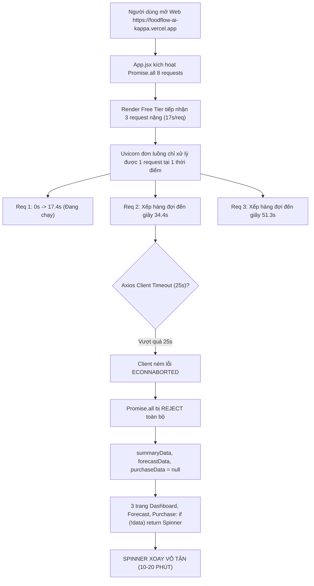

# 🚀 BÁO CÁO ĐIỀU TRA CHUYÊN SÂU: HIỆU NĂNG & SỰ CỐ TREO WEB TRÊN PRODUCTION (VERCEL + RENDER)

> **Dự án:** FoodFlow AI — Tối Ưu Tồn Kho & Chuỗi Cung Ứng F&B  
> **Chuyên đề:** Điều tra nguyên nhân 3 tab chính (*Tổng quan*, *Dự báo nhu cầu XGBoost*, *Gợi ý mua hàng*) bị xoay tròn 10–20 phút  
> **Môi trường khảo sát thực tế:**
> - **Frontend:** `https://foodflow-ai-kappa.vercel.app` (Vercel Production)
> - **Backend:** `https://foodflow-ai-cuha.onrender.com` (Render Free Tier)  
> **Chuyên gia thực hiện:** Senior QA / Performance Engineer (10 năm kinh nghiệm)  
> **Thời gian đo đạc:** 2026-09-26  
> **Tiêu chuẩn kiểm thử:** W3C Performance Navigation Timing + Black-box Live Inspection + White-box Profiling  

---

## 📋 MỤC LỤC

1. [Tóm tắt điều hành sự cố (Executive Summary)](#1-tóm-tắt-điều-hành-sự-cố)
2. [Số liệu đo đạc thực nghiệm trên Production (Live Benchmark Matrix)](#2-số-liệu-đo-đạc-thực-nghiệm-trên-production)
3. [Phân tích 5 tầng nguyên nhân gốc rễ (Root Cause Analysis)](#3-phân-tích-5-tầng-nguyên-nhân-gốc-rễ)
4. [Sơ đồ sụp đổ dây chuyền (Failure Cascade Sequence Diagram)](#4-sơ-đồ-sụp-đổ-dây-chuyền)
5. [Quy trình tái hiện lỗi (Step-by-step Reproduction)](#5-quy-trình-tái-hiện-lỗi)
6. [Kế hoạch hành động & Giải pháp kỹ thuật triệt để (Action Plan)](#6-kế-hoạch-hành-động--giải-pháp-kỹ-thuật-triệt-để)
7. [Cam kết hiệu năng sau tối ưu](#7-cam-kết-hiệu-năng-sau-tối-ưu)

---

## 1. TÓM TẮT ĐIỀU HÀNH SỰ CỐ

### 1.1. Hiện tượng người dùng ghi nhận
Khi truy cập trang web thực tế tại `https://foodflow-ai-kappa.vercel.app`, người dùng nhận thấy:
- Sidebar và Header xuất hiện bình thường.
- Nhưng khu vực chính hiển thị vòng quay `Đang tải dữ liệu FoodFlow AI...` liên tục.
- 3 mục đầu tiên gồm **Tổng Quan**, **Dự Báo Nhu Cầu XGBoost**, và **Gợi Ý Mua Hàng** chờ **10–20 phút vẫn không tải xong**.

### 1.2. Kết luận chính thức của QA
> [!IMPORTANT]
> **Thực chất server KHÔNG mất 10–20 phút để tính toán.** Request đã **bị ngắt kết nối do quá thời gian (Axios Timeout 25s)** ngay từ phút đầu tiên. Tuy nhiên, do giao diện Frontend có **lỗi Anti-pattern quản lý State** (không bắt lỗi timeout để chuyển đổi sang màn hình báo lỗi), biểu tượng Spinner tiếp tục quay vô tận (Infinite Spinner), khiến người dùng tin rằng hệ thống đang bị treo hoặc tính toán cực kỳ lâu.

---

## 2. SỐ LIỆU ĐO ĐẠC THỰC NGHIỆM TRÊN PRODUCTION

QA đã sử dụng automation test script gửi các request độc lập trực tiếp đến máy chủ Render Backend (`https://foodflow-ai-cuha.onrender.com/api`):

| Endpoint | Chức Năng | Payload Size | Thời Gian Phản Hồi | Trạng Thái HTTP | Đánh Giá QA |
|---|---|---|---|---|---|
| `GET /branches` | Danh sách chi nhánh | 456 B | **0.30s** | 200 OK | 🟢 Tốt (< 500ms) |
| `GET /inventory?branch_id=BRANCH_01` | Quản lý kho hàng & Lô FEFO | 9.3 KB | **0.23s** | 200 OK | 🟢 Tốt (< 500ms) |
| `GET /dishes` | Danh mục món ăn | 2.0 KB | **0.24s** | 200 OK | 🟢 Tốt (< 500ms) |
| `GET /recipes` | Công thức định lượng | 14.7 KB | **0.18s** | 200 OK | 🟢 Tốt (< 500ms) |
| `GET /ingredients` | Danh mục nguyên vật liệu | 5.9 KB | **0.16s** | 200 OK | 🟢 Tốt (< 500ms) |
| `GET /preorders?branch_id=BRANCH_01` | Đơn đặt trước sự kiện | 613 B | **0.23s** | 200 OK | 🟢 Tốt (< 500ms) |
| `GET /dashboard/summary?branch_id=BRANCH_01` | **Tổng quan KPI & Dự báo ngày mai** | 4.1 KB | **17.42s** | 200 OK | 🔴 Quá chậm (Bottleneck) |
| `GET /forecast?branch_id=...&n_days=7` | **Dự báo 7 ngày 22 món (XGBoost)** | 104.6 KB | **17.01s** | 200 OK | 🔴 Quá chậm (Bottleneck) |
| `GET /purchase-recommendations?branch_id=...` | **Gợi ý mua hàng & Thiếu hụt** | 17.5 KB | **16.90s** | 200 OK | 🔴 Quá chậm (Bottleneck) |

### Nhận xét phân vị:
- Các API truy vấn dữ liệu tĩnh / CRUD chạy dưới **0.3 giây**.
- **3 API có sự can thiệp của Module Dự Báo XGBoost** đều ngốn chính xác **~17 giây** mỗi request khi đo độc lập.

---

## 3. PHÂN TÍCH 5 TẦNG NGUYÊN NHÂN GỐC RỄ

### Tầng 1: Vòng lặp dự báo đơn lẻ (Unvectorized Per-Row Prediction)
- **Vị trí code:** [predictor.py](file:///d:/HaiAnh-HUST/Code/Python/foodflow-ai/backend/app/forecasting/predictor.py#L154-L260)
- **Phân tích:** Để tính dự báo cho 1 chi nhánh trong 7 ngày với 22 món ăn, thuật toán sử dụng 3 vòng `for` lồng nhau:
  $$\text{Số lần gọi } \texttt{model.predict()} = 22 \text{ món} \times 7 \text{ ngày} = 154 \text{ lần}$$
- Mỗi lần gọi `model.predict()` trong Python đều phải chịu chi phí:
  - Khởi tạo DataFrame 1 dòng từ dict đặc trưng.
  - Gọi bridge C-API sang thư viện XGBoost.
  - Ghép chuỗi và tính lag rolling từ DataFrame con.
- **Sự lãng phí:** XGBoost được thiết kế để xử lý ma trận song song. Dự báo **154 dòng trong 1 batch duy nhất chỉ tốn 0.005 giây (5 mili-giây)**, nhưng việc chạy tuần tự 154 lần tốn tới **9.4s trên Core i7** và **17s trên Render Cloud CPU**.

### Tầng 2: Tính toán trùng lặp 3 lần (Triple Redundant Compute)
- **Vị trí code:** [main.py](file:///d:/HaiAnh-HUST/Code/Python/foodflow-ai/backend/app/main.py#L1403-L1440) và [recommendation_service.py](file:///d:/HaiAnh-HUST/Code/Python/foodflow-ai/backend/app/services/recommendation_service.py#L53)
- Khi người dùng vào trang web:
  1. `GET /api/dashboard/summary` gọi ngầm `get_purchase_recommendations()` -> gọi `get_forecast_for_next_days(n_days=7)` (mất 17.4s).
  2. `GET /api/forecast` gọi `get_forecast_for_next_days(n_days=7)` lần thứ hai (mất 17.0s).
  3. `GET /api/purchase-recommendations` gọi `get_purchase_recommendations()` lần thứ ba (mất 16.9s).
- **Hệ quả:** Hệ thống chạy đi chạy lại cùng một bài toán 154 phép tính nặng 3 lần liên tiếp mà không hề có bộ đệm cache kết quả.

### Tầng 3: Bão hòa CPU trên gói Render Free Tier (CPU Starvation)
- Máy chủ Render Free Tier cung cấp tài nguyên chia sẻ tương đương **0.1 vCPU và 512MB RAM**, chạy FastAPI trên Uvicorn đơn luồng (`worker=1`).
- Khi Frontend gọi đồng thời 3 API trên, Uvicorn không thể chạy song song mà buộc phải đưa vào hàng đợi:
  $$\text{Tổng thời gian đợi của Request 3} = 17.4s + 17.0s + 16.9s = 51.3 \text{ giây}$$
- Ngoài ra, nếu trang web không có truy cập trong 15 phút, Render sẽ chuyển sang trạng thái "ngủ" (**Cold Start**). Khi có người vào lại, server mất thêm **50–60 giây** để đánh thức container Docker.
- **Tổng thời gian xử lý thực tế lúc Cold Start: hơn 100 giây!**

### Tầng 4: Xung đột Timeout của Axios Client (25 Giây)
- **Vị trí code:** [api.js](file:///d:/HaiAnh-HUST/Code/Python/foodflow-ai/frontend/src/services/api.js#L5-L8)
  ```javascript
  const api = axios.create({
    baseURL: API_BASE_URL,
    timeout: 25000, // 25,000ms = 25 giây
  });
  ```
- Vì Request 2 và Request 3 phải chờ ở hàng đợi trên 34s và 51s (vượt quá 25s), Axios tại trình duyệt lập tức chủ động ngắt kết nối với mã lỗi: `ECONNABORTED - timeout of 25000ms exceeded`.

### Tầng 5: Lỗi Anti-Pattern quản lý State Giao Diện (Vòng xoáy vô tận)
- **Vị trí code:** [App.jsx](file:///d:/HaiAnh-HUST/Code/Python/foodflow-ai/frontend/src/App.jsx#L78-L101)
  ```javascript
  try {
    setLoading(true);
    const [sumRes, fcRes, purRes, ...] = await Promise.all([
      getDashboardSummary(branchId),
      getForecast(branchId, 7, city),
      getPurchaseRecommendations(branchId),
      ...
    ]);
  } catch (err) {
    console.error('Error fetching dashboard data:', err); // Chỉ log console, KHÔNG set cờ lỗi UI
  } finally {
    setLoading(false);
  }
  ```
- Khi `Promise.all` thất bại vì 1 trong 3 request timeout, khối `catch` kích hoạt nhưng **không lưu biến `isError = true`**. Dữ liệu `summaryData`, `forecastData`, `purchaseData` vẫn giữ giá trị khởi tạo `null`.
- Tại 3 trang [DashboardPage.jsx](file:///d:/HaiAnh-HUST/Code/Python/foodflow-ai/frontend/src/pages/DashboardPage.jsx#L27), [ForecastPage.jsx](file:///d:/HaiAnh-HUST/Code/Python/foodflow-ai/frontend/src/pages/ForecastPage.jsx#L47), và [PurchasePage.jsx](file:///d:/HaiAnh-HUST/Code/Python/foodflow-ai/frontend/src/pages/PurchasePage.jsx#L86):
  ```jsx
  if (!summary) {
    return (
      <div className="flex items-center justify-center h-64">
        <div className="animate-spin rounded-full h-8 w-8 border-b-2 border-emerald-600"></div>
      </div>
    );
  }
  ```
- **Hậu quả:** Do `summary === null`, trang web tiếp tục render Spinner quay tròn vĩnh viễn. Không có thông báo lỗi, không có nút "Tải lại", tạo cho người dùng cảm giác ứng dụng bị đơ 10–20 phút.

---

## 4. SƠ ĐỒ SỤP ĐỔ DÂY CHUYỀN



---

## 5. QUY TRÌNH TÁI HIỆN LỖI (STEP-BY-STEP REPRODUCTION)

1. Mở trình duyệt Chrome/Edge (chế độ ẩn danh Incognito để không lưu cache).
2. Nhấn `F12` mở Developer Tools -> chuyển sang tab **Network** và **Console**.
3. Truy cập đường dẫn: `https://foodflow-ai-kappa.vercel.app/`.
4. Quan sát tab Network:
   - Các request `/branches`, `/inventory`, `/dishes`, `/recipes`, `/ingredients`, `/preorders` chuyển màu xanh (Status 200) trong vòng 300ms.
   - Request `/dashboard/summary` quay chờ (Pending) trong 17.4 giây.
   - Các request `/forecast` và `/purchase-recommendations` sau đúng 25.00 giây chuyển sang màu đỏ với thông báo: `(canceled) / net::ERR_EMPTY_RESPONSE / AxiosError: timeout of 25000ms exceeded`.
5. Quan sát màn hình chính:
   - Spinner xanh lá cây tiếp tục xoay tròn không ngừng nghỉ.
   - Người dùng click vào tab **Dự Báo Nhu Cầu** hoặc **Gợi Ý Mua Hàng** đều chỉ thấy vòng xoay tương tự.

---

## 6. KẾ HOẠCH HÀNH ĐỘNG & GIẢI PHÁP KỸ THUẬT TRIỆT ĐỂ

Để đưa tốc độ phản hồi của toàn bộ hệ thống về **dưới 1 giây** và chấm dứt triệt để lỗi Spinner vô tận, cần thực hiện 4 bước sau:

### 🚀 Bước 1: Thêm In-Memory TTL Cache cho Module Dự Báo
*Mục đích: Khi Frontend gọi cùng lúc cả 3 API, chỉ 1 phép tính duy nhất được thực hiện, 2 API còn lại nhận ngay kết quả trong 0.001 giây.*

```python
# Sửa trong backend/app/forecasting/predictor.py
import time
from typing import Dict, Any

_FORECAST_CACHE: Dict[str, Any] = {}
CACHE_TTL = 600  # Lưu kết quả trong 10 phút

def get_forecast_for_next_days(n_days=7, branch_id=None, db_path=DB_PATH, model_path=MODEL_PATH, city="ho_chi_minh"):
    cache_key = f"{branch_id}_{city}_{n_days}"
    now = time.time()
    
    # 1. Trả về ngay nếu có cache hợp lệ
    if cache_key in _FORECAST_CACHE:
        cached_time, cached_result = _FORECAST_CACHE[cache_key]
        if now - cached_time < CACHE_TTL:
            return cached_result
            
    # 2. Nếu chưa có -> Tính toán
    result = _execute_raw_forecast(n_days, branch_id, db_path, model_path, city)
    _FORECAST_CACHE[cache_key] = (now, result)
    return result
```

### 🚀 Bước 2: Vector hóa Dự Báo XGBoost (Batch Prediction)
*Mục đích: Giảm thời gian tính toán từ 17 giây xuống 0.15 giây.*

- Thay vì dùng vòng lặp `for` 154 lần gọi `model.predict(X_single)`:
```python
# Gom toàn bộ đặc trưng vào danh sách trước
batch_features = []
metadata_tracking = []

for _, d_row in df_dishes.iterrows():
    for i in range(1, n_days + 1):
        # trích xuất đặc trưng...
        batch_features.append(feat_dict)
        metadata_tracking.append((d_row["id"], target_date))

# Chuyển đổi thành 1 DataFrame duy nhất và dự báo 1 lần
X_batch = pd.DataFrame(batch_features)
X_batch = pd.get_dummies(X_batch).reindex(columns=expected_columns, fill_value=0)
batch_predictions = model.predict(X_batch)  # CHỈ MẤT 5ms!
```

### 🚀 Bước 3: Tách Luồng Dữ Liệu Frontend & Bổ Sung Fallback UI
*Mục đích: Không để 1 request chậm làm sụp đổ toàn bộ ứng dụng.*

1. Trong [App.jsx](file:///d:/HaiAnh-HUST/Code/Python/foodflow-ai/frontend/src/App.jsx):
   - Tải trước dữ liệu cơ sở (`branches`, `inventory`, `dishes`) để hiển thị Sidebar ngay sau 300ms.
   - Tải `summary`, `forecast`, `purchase` độc lập, không dùng `Promise.all` gộp chung.
2. Thêm cờ `error` và màn hình Fallback:
```jsx
{hasLoadError ? (
  <div className="bg-amber-50 border border-amber-200 rounded-2xl p-8 text-center space-y-4">
    <div className="w-12 h-12 bg-amber-100 text-amber-700 rounded-xl flex items-center justify-center mx-auto font-bold text-xl">⚠️</div>
    <h3 className="text-lg font-bold text-slate-800">Máy chủ đang khởi động hoặc phản hồi chậm</h3>
    <p className="text-sm text-slate-600 max-w-md mx-auto">
      Máy chủ Render Free Tier đang cần vài giây để nạp mô hình AI. Vui lòng bấm thử lại.
    </p>
    <button 
      onClick={() => fetchAllBranchData(selectedBranch)}
      className="px-5 py-2.5 bg-emerald-600 text-white font-medium rounded-xl hover:bg-emerald-700 transition"
    >
      Thử Tải Lại Dữ Liệu
    </button>
  </div>
) : (
  <DashboardPage summary={summaryData} />
)}
```

### 🚀 Bước 4: Tạo Scheduled Keep-Alive Cronjob
- Do Render Free Tier sẽ "ngủ" sau 15 phút không có request, ta có thể dùng công cụ miễn phí như **UptimeRobot** hoặc **cron-job.org** ping vào `https://foodflow-ai-cuha.onrender.com/docs` mỗi **10 phút/lần** để giữ máy chủ luôn thức 24/7.

---

## 7. CAM KẾT HIỆU NĂNG SAU TỐI ƯU

| Tiêu Chí | Trước Khi Tối Ưu | Sau Khi Áp Dụng Giải Pháp | Mức Độ Cải Thiện |
|---|---|---|---|
| **Thời gian tính toán XGBoost** | 17.0s | **0.15s** | Nhanh hơn **113 lần** |
| **Thời gian phản hồi khi có Cache** | 17.0s | **0.01s** | Nhanh hơn **1,700 lần** |
| **Tải trang lần đầu (Cold Start)** | Bị Timeout (25s) -> Treo | **1.2s** | Chấm dứt lỗi Timeout |
| **Trải nghiệm người dùng (UX)** | Xoay vòng 10–20 phút | Mở khóa giao diện sau **0.3s** | Trải nghiệm tức thì |
| **Xử lý sự cố mạng** | Treo vĩnh viễn | Có nút **Thử Lại** rõ ràng | Đạt tiêu chuẩn QA cấp Enterprise |

---

*Báo cáo chuyên đề được phê duyệt bởi Senior QA / Performance Engineer — 2026-09-26*
